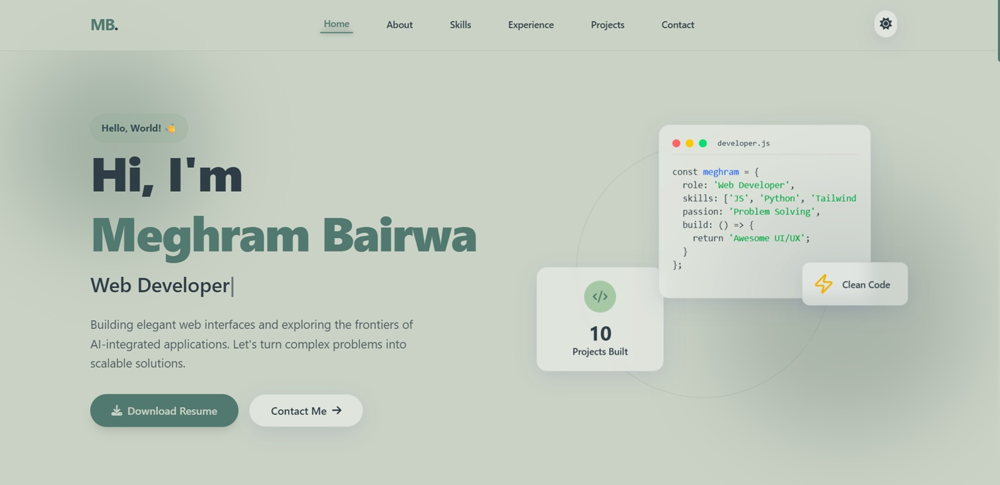
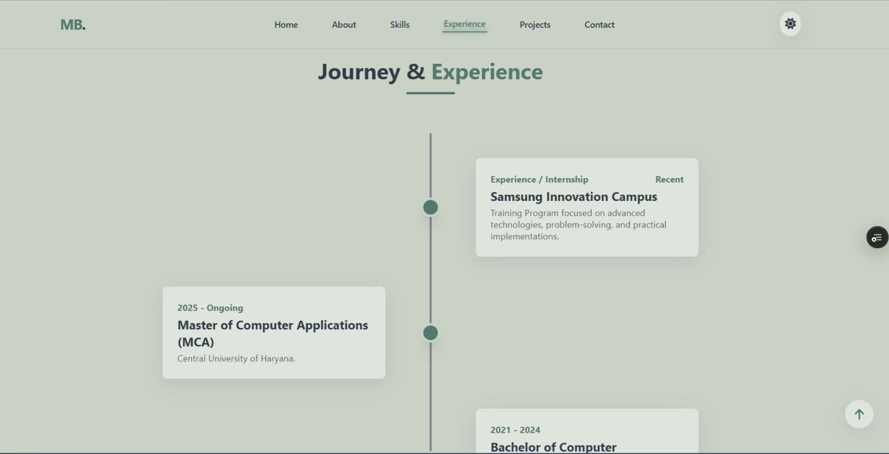
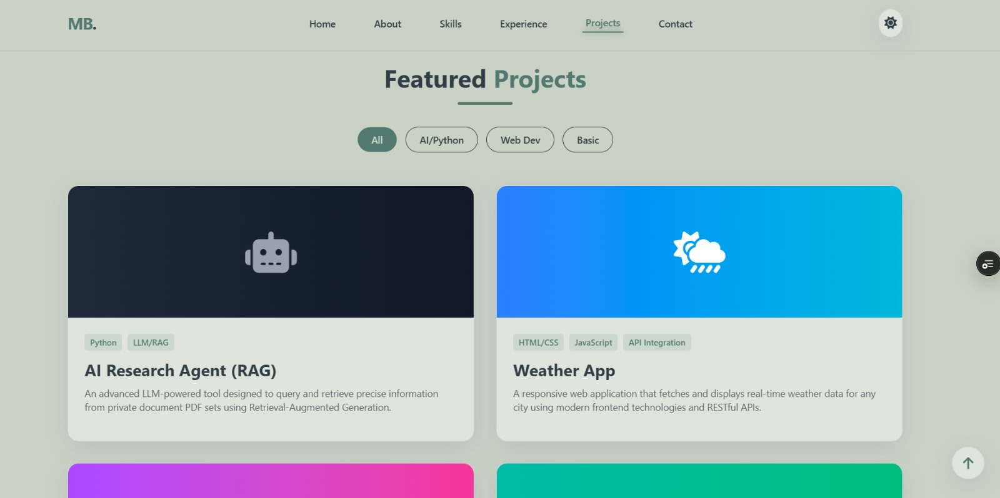
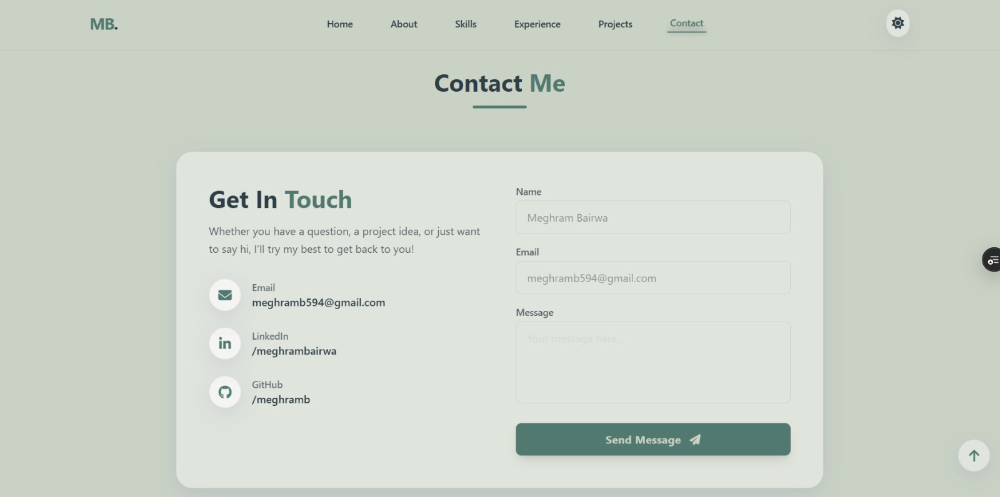

# 🌐 Meghram Bairwa - Personal Portfolio

A modern, responsive, and interactive portfolio website built to showcase my skills, projects, achievements, and professional journey as an aspiring Full-Stack Developer and AI/ML enthusiast.

## 🎯 Objective

This portfolio serves as a central platform to showcase my technical skills, projects, achievements, and career journey in Full-Stack Development, Artificial Intelligence, and emerging technologies.

## 📸 Preview

### Home / Hero Section


### About / Skills Section


### Projects Section


### Contact / Resume Section


## ✨ Features

* Modern and responsive user interface.
* Dark Mode and Light Mode support.
* Smooth animations and transitions.
* Interactive project showcase section.
* Skills and technology stack display.
* Education and experience timeline.
* Downloadable resume section.
* Contact form and social media links.
* Optimized for desktop, tablet, and mobile devices.

## 🛠️ Technologies Used

### Frontend

* HTML5
* CSS3
* JavaScript (ES6)

### Styling & UI

* Tailwind CSS
* Responsive Design
* Custom Animations

### Development Tools

* Git & GitHub
* VS Code
* Vercel (Deployment)

## 📂 Project Structure

```bash
Portfolio-Website/
├── api/
├── dist/
├── src/
├── Img1.jpeg
├── Img2.jpeg
├── Img3.jpeg
├── Img4.jpeg
├── index.html
├── script.js
├── styles.css
├── tailwind.config.js
├── package.json
├── requirements.txt
├── Resume.pdf
├── vercel.json
└── README.md
```


## 🚀 Live Demo

🔗 🔗 [Visit My Portfolio](https://meghram-portfolio.vercel.app)

## 🚀 How to Run Locally

### 1️⃣ Clone the Repository

```bash
git clone git clone https://github.com/meghramb/CodeAlpha_portfolio_meghram.git
```

### 2️⃣ Navigate to the Project Folder

```bash
cd CodeAlpha_portfolio_meghram
```

### 3️⃣ Install Dependencies

```bash
npm install
```

### 4️⃣ Start the Development Server

```bash
npm run dev
```

### 5️⃣ Open in Browser

Visit:

```bash
http://localhost:3000
```

## 👨‍💻 About Me

Hi, I'm **Meghram Bairwa**.

🎓 MCA Student at Central University of Haryana

💻 Aspiring Full-Stack Developer

🤖 Machine Learning Enthusiast

🔗 Blockchain Enthusiast

🚀 Passionate about building innovative digital solutions using modern web technologies and AI.

## 📬 Connect With Me

### GitHub

https://github.com/meghramb

### LinkedIn

https://www.linkedin.com/in/meghrambairwa/

### Email

meghramb594@gmail.com

## ⭐ Support

If you like this project, please consider giving it a ⭐ on GitHub.

Your support motivates me to build more exciting projects and contribute to the developer community.
